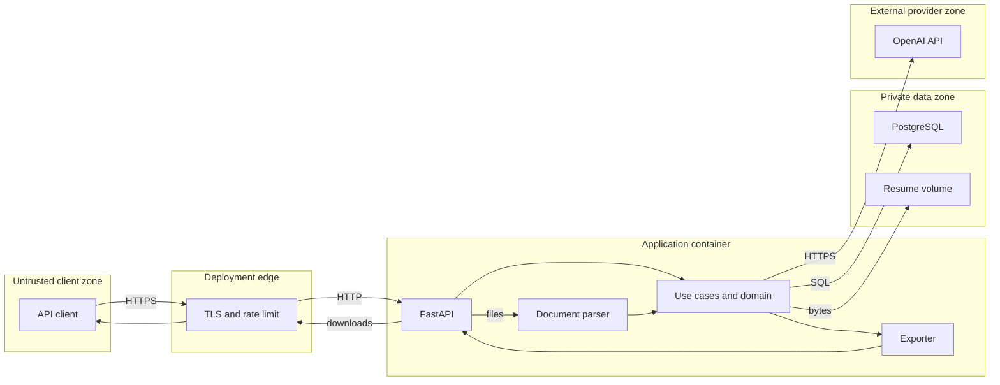

# AI Resume & Job Match Agent threat model

## Executive summary

The highest risks are disclosure of highly sensitive resume PII through a stolen application-wide API key, unencrypted database/file volumes or backups, and intentional transfer to OpenAI without an adequate consent and data-processing posture. Crafted PDF/DOCX parsing occurs inside the API process, so a parser vulnerability can affect service confidentiality and availability. Structured-output prompts and a deterministic fact guard reduce AI manipulation, but generated text still needs human review because the guard cannot prove every rewritten claim. Public deployment is viable only behind the assumed TLS and shared rate-limiting edge and with explicit storage encryption, key rotation, retention, monitoring, and provider-governance controls.

## Scope and assumptions

In scope:

- runtime code under `src/resume_matcher/`, including every API route, document parser, AI adapter, matching/fact policies, persistence, storage, exports, configuration, error handling, logging, and rate limiting;
- database migrations in `alembic/`;
- runtime packaging and self-hosted deployment in `Dockerfile` and `docker-compose.yml`;
- security-relevant build controls in `pyproject.toml`, `uv.lock`, `.github/workflows/ci.yml`, and `.github/dependabot.yml`.

Out of scope except as trust-boundary assumptions:

- implementation and security of the deployment's TLS reverse proxy, WAF/shared rate limiter, firewall, host OS, volume encryption, backup system, and secrets manager;
- OpenAI's internal service controls and the user's OpenAI account configuration;
- security of API client devices and downloaded exports;
- legal conclusions, hiring validity, model fairness, and ATS behavior;
- unrelated GitHub organization policy and release signing because this repository does not define a release pipeline.

Context supplied for this model:

- the service may be exposed to the public internet behind deployment-managed TLS and edge rate limiting;
- it is an API-key-protected, single-tenant MVP rather than a multi-user SaaS;
- resume content is highly sensitive PII;
- the target deployment is self-hosted Docker with PostgreSQL and a persistent file volume;
- callers with a valid key are expected users, but their uploaded documents and job text remain untrusted data.

Evidence anchors: `src/resume_matcher/app.py:create_app`, `src/resume_matcher/presentation/api/dependencies.py:require_api_key`, `docker-compose.yml`, and `src/resume_matcher/infrastructure/persistence/models.py`.

Open questions that would materially change risk ranking:

- How are application keys issued, distributed, rotated, revoked, and separated between environments?
- Are PostgreSQL, file, and backup volumes encrypted, and can deletion be propagated to every backup copy under a defined retention policy?
- Which OpenAI data controls, region, retention terms, consent notice, and data-processing agreement apply when `AI_PROVIDER=openai`?
- What peak concurrency, token budget, and recovery-time objectives must the deployment support?

## System model

### Primary components

- **Deployment edge (assumed):** terminates TLS and enforces shared request/body rate controls before traffic reaches Uvicorn. No edge configuration is present in the repository.
- **FastAPI presentation:** exposes health, resume, job, match, optimization, and export routes; resolves bearer authentication and services; validates Pydantic transport schemas. Evidence: `src/resume_matcher/app.py` and `src/resume_matcher/presentation/api/routers/`.
- **Document parser:** processes attacker-controlled PDF/DOCX bytes with PyMuPDF and python-docx after extension, MIME, signature, size, page, ZIP-part, expansion, and compression-ratio checks. Evidence: `src/resume_matcher/infrastructure/parsing/document_parser.py:SecureDocumentParser`.
- **Application/domain:** orchestrates resources and applies deterministic matching, recommendations, normalization, and the optimization fact guard. Evidence: `src/resume_matcher/application/services/` and `src/resume_matcher/domain/`.
- **AI adapters:** local heuristics run offline; the OpenAI adapter sends resume/job content through the official Responses API and validates typed output. Evidence: `src/resume_matcher/infrastructure/ai/local.py` and `openai_adapter.py`.
- **Persistence and storage:** async SQLAlchemy stores raw/structured profiles and analysis JSON; a UUID-addressed filesystem volume stores original bytes. Evidence: `src/resume_matcher/infrastructure/persistence/` and `src/resume_matcher/infrastructure/storage.py`.
- **Exporter:** renders selected resume data as JSON, DOCX, or PDF. JSON always serializes the target `JobProfile` with raw job text and serializes raw resume text when the selected resume is the original `ResumeProfile`; an optimized resume has no raw-text field. Evidence: `src/resume_matcher/infrastructure/export/resume_exporter.py:MultiFormatResumeExporter`.
- **Build/CI:** uv lock file, Python quality matrix, migration lifecycle, dependency audit, Docker build, pinned GitHub Action commits, and Dependabot configuration. Evidence: `uv.lock` and `.github/workflows/ci.yml`.

### Data flows and trust boundaries

- **Internet client → deployment edge → FastAPI:** bearer keys, UUIDs, JSON text, multipart documents, and export requests cross HTTPS at the assumed edge, then HTTP or an operator-defined internal channel to Uvicorn. Production requires at least one application key; the app validates trusted hosts and optional CORS, validates `Content-Length`, buffers/counts actual ASGI chunks to cap chunked bodies, and applies a per-process rate check to expensive POST routes. Edge TLS and global rate limits are assumptions, not repository controls. Evidence: `config/settings.py:validate_secure_production_configuration`, `presentation/api/dependencies.py`, and `presentation/api/middleware.py`.
- **FastAPI → parser:** untrusted bytes cross an in-process function boundary. File extension, declared MIME type, magic bytes, upload length, PDF pages/password/text, and DOCX package/expansion controls are checked before or during parsing. The parser shares the API process and OS privileges. Evidence: `presentation/api/routers/resumes.py:upload_resume` and `infrastructure/parsing/document_parser.py`.
- **Application → OpenAI:** raw resume/job text, PII, structured profiles, and match evidence cross an external HTTPS boundary authenticated with `OPENAI_API_KEY`. Content is labeled as untrusted data, structured output is Pydantic-validated, SDK timeout/retries apply, and provider failures are mapped. There is no application redaction, consent record, field minimization, or live provider-health probe. Evidence: `infrastructure/ai/openai_adapter.py`, `prompts.py`, and `contracts.py`.
- **Application → PostgreSQL:** raw job text, raw resume text inside JSON, contact details, match evidence, and optimized resumes cross an async SQLAlchemy connection using `DATABASE_URL`. ORM parameterization and typed serialization are present; Compose uses a private Docker network but does not configure database TLS or application-layer field encryption. Evidence: `infrastructure/persistence/models.py`, `serialization.py`, and `docker-compose.yml`.
- **Application → filesystem volume:** original resume bytes cross a local file boundary. A server-generated UUID and resolved-path containment prevent filename traversal; the directory is forced to `0700`, temporary/original bytes to `0600`, atomic replace is used, and failed-write temporary files are removed. No application-layer encryption, malware scan, or retention worker is implemented. Evidence: `infrastructure/storage.py:FileSystemDocumentStorage`, `application/services/resume_service.py`, and `Dockerfile`.
- **Application → client export:** sensitive selected-resume/job/match data cross the API boundary as downloadable JSON; raw job text is always present and raw resume text is present before optimization. DOCX/PDF contain the selected resume. Bearer auth, `nosniff`, `no-store`, and generated filenames apply. There is no per-resource authorization, download audit event, or export-specific rate limit. Evidence: `presentation/api/routers/matches.py:export_match`, `presentation/api/middleware.py:SecurityHeadersMiddleware`, and `infrastructure/export/resume_exporter.py`.
- **Developer/GitHub → CI → container image:** source, workflow definitions, locked dependencies, third-party actions, base images, and build outputs cross the software supply-chain boundary. Actions use commit SHAs and CI audits Python dependencies; base image tags are not digest-pinned and the workflow shown does not publish/sign an image. Evidence: `.github/workflows/ci.yml`, `Dockerfile`, and `pyproject.toml`.

#### Diagram

## Assets and security objectives

| Asset | Why it matters | Security objective (C/I/A) |
|---|---|---|
| Original PDF/DOCX resumes | Contains direct identifiers, contact data, career history, education, and potentially protected/sensitive facts | C high, I high, A medium |
| Structured resume profiles and raw text | Searchable/concentrated PII stored in database JSON, used for scoring, and potentially included in pre-optimization JSON exports | C high, I high, A medium |
| Job descriptions and profiles | May contain confidential hiring plans and define the integrity of matching | C medium, I high, A medium |
| Match results and recommendations | Affects user decisions and reputation; evidence and version must remain attributable | C medium, I high, A medium |
| Optimized resumes and exports | User-facing artifacts can cause harm if false or disclosed | C high, I high, A medium |
| Application API keys | A valid key authorizes all non-health resources in the single tenant | C high, I high, A high |
| OpenAI API key and budget | Theft enables external use/cost and possibly account-level exposure | C high, I medium, A high |
| Database credentials/configuration | Controls access to all structured data | C high, I high, A high |
| API/parser compute capacity | Synchronous parsing and provider waits consume finite workers/memory | C low, I medium, A high |
| Logs and request IDs | Support incident investigation but paths/errors can become a secondary metadata/PII sink | C medium, I high, A medium |
| Source, lock file, CI workflow, container image | Compromise can insert code that exfiltrates every later resume/secret | C high, I high, A high |

## Attacker model

### Capabilities

- A remote internet attacker can reach the assumed public edge and public health routes, test authentication, and send malformed protocol input.
- A legitimate caller—or attacker who steals a shared application key—can upload arbitrary PDF/DOCX bytes within edge/application limits, submit arbitrary job text, trigger AI work, create matches, optimize, and export known UUID resources.
- Uploaded documents and job text can contain prompt-injection instructions, adversarial parser structures, misleading facts, extreme repetition, and content intended to influence generated output.
- An attacker may obtain resource UUIDs from a shared client, downloaded file, browser history, support exchange, or logs after another compromise.
- A malicious/compromised dependency or accepted repository change can execute in CI/build or later inside the API image.
- A host, volume, database, backup, or operator-account compromise is plausible in a self-hosted deployment and is modeled for data-at-rest impact.

### Non-capabilities

- Without a valid application key or separate infrastructure compromise, the attacker cannot call resume/job/match routes under the stated production configuration; health routes remain public.
- There are no list/search endpoints, predictable integer IDs, user-supplied storage paths, arbitrary URL fetches, subprocess execution, plugin loading, or code-evaluation features in the runtime.
- A document cannot directly choose SQL text or a filesystem filename; SQLAlchemy operations and server-generated UUID paths constrain those channels.
- This model does not assume compromise of OpenAI internals, the TLS edge, the host root account, GitHub, or a client device as an initial attacker capability; it evaluates impact if those explicit trust assumptions fail.
- The single-tenant MVP has no cross-tenant boundary. The relevant authorization risk is that every valid shared key has global application authority.

## Entry points and attack surfaces

| Surface | How reached | Trust boundary | Notes | Evidence (repo path / symbol) |
|---|---|---|---|---|
| Liveness | `GET /api/v1/health/live` | Internet → API | Public; reports status/version | `presentation/api/routers/health.py:liveness` |
| Readiness | `GET /api/v1/health/ready` | Internet → API/DB | Public; queries DB and reveals selected provider | `presentation/api/routers/health.py:readiness` |
| Resume upload | `POST /api/v1/resumes` | Client → API → parsers/storage/AI | Highest-risk input: multipart bytes, filename, MIME, PII | `presentation/api/routers/resumes.py:upload_resume` |
| Resume retrieval | `GET /api/v1/resumes/{id}` | Client → API/DB | Global key plus UUID; API omits raw text | `presentation/api/routers/resumes.py:get_resume` |
| Resume deletion | `DELETE /api/v1/resumes/{id}` | Client → API/DB/files | Non-atomic DB/file deletion; backup lifecycle external | `application/services/resume_service.py:delete` |
| Job creation | `POST /api/v1/jobs` | Client → API/AI/DB | Arbitrary prompt-like text, 100-character schema minimum, configured maximum | `presentation/api/routers/jobs.py:create_job` |
| Job retrieval | `GET /api/v1/jobs/{id}` | Client → API/DB | Global key plus UUID | `presentation/api/routers/jobs.py:get_job` |
| Match creation | `POST /api/v1/matches` | Client → API/DB/domain | User supplies resume/job UUIDs; no per-resource ownership | `presentation/api/routers/matches.py:create_match` |
| Match retrieval | `GET /api/v1/matches/{id}` | Client → API/DB | Returns score evidence and optimized resume when present | `presentation/api/routers/matches.py:get_match` |
| Optimization | `POST /api/v1/matches/{id}/optimize` | Client → API/OpenAI/DB | Synchronous external generation and fact-guard validation | `application/services/match_service.py:optimize` |
| Export | `GET /api/v1/matches/{id}/exports/{format}` | Client → API/DB/exporter | JSON includes raw job text and can include raw resume text; DOCX/PDF include PII; not locally rate limited | `presentation/api/routers/matches.py:export_match` |
| Request headers/body | Every HTTP request | Edge → middleware | Host, content length, bearer token, request ID, CORS origin | `presentation/api/middleware.py`, `dependencies.py` |
| Environment configuration | Process startup | Operator/secrets → app | Keys, DB URL, provider, paths, logging and limits | `config/settings.py:Settings` |
| PostgreSQL | Docker network / configured URL | App → private data zone | Raw/structured PII; no DB TLS configured by Compose | `docker-compose.yml`, `persistence/models.py` |
| Resume volume | Mounted storage path | App → host volume | Original bytes stored as UUID `.bin` files | `infrastructure/storage.py` |
| OpenAI Responses API | Outbound SDK call | App → external provider | Full sensitive context; API key authentication | `infrastructure/ai/openai_adapter.py` |
| CI and dependency resolution | Push/PR/Dependabot | Developer/GitHub → runner/build | Executes workflow actions and dependency tooling | `.github/workflows/ci.yml`, `uv.lock` |

## Top abuse paths

1. **Exfiltrate a known applicant record:** steal or obtain a shared bearer key → obtain a resume or match UUID from a client/log/support channel → call retrieval or JSON export → receive structured PII, raw job text, and potentially pre-optimization raw resume text → disclose or misuse the record.
2. **Exploit a document parser:** use a valid/stolen key → upload a crafted PDF/DOCX that passes outer signature/size checks → trigger a PyMuPDF/python-docx vulnerability in the API process → crash workers or execute with the container user's access → reach mounted resume data, DB credentials, or OpenAI key.
3. **Manipulate an optimized resume:** embed adversarial instructions and misleading structure in resume/job text → influence LLM extraction or optimization despite data delimiters → produce altered facts not covered by deterministic checks → user trusts/submits the draft → reputational or employment harm.
4. **Disclose PII to an unintended processor:** enable OpenAI mode without informed consent/provider governance → upload a resume → full text/contact details cross the provider boundary → retention, region, or contractual requirements are violated.
5. **Exhaust workers or AI budget:** obtain a valid key → distribute repeated upload/job/optimization calls across workers or source addresses → exploit per-process rate state and synchronous provider waits → consume worker capacity, memory, retries, tokens, and cost → deny normal use.
6. **Recover retained deleted data:** user deletes a resume → database/file deletion succeeds only in the live instance → raw profiles, job text, JSON exports, snapshots, or backups remain because retention is not automated → later operator/backup compromise discloses supposedly deleted PII.
7. **Steal all persisted PII:** compromise the self-hosted host, PostgreSQL credential, mounted volume, or backup account → read unencrypted-at-application data → correlate raw documents, profiles, and analyses → bulk confidentiality loss.
8. **Compromise the software supply chain:** introduce or take over a dependency/base image/source change → CI builds or an operator deploys it → malicious runtime reads environment secrets and every processed resume → exfiltrate data without using API authorization.
9. **Hide abuse in insufficient telemetry:** reuse a valid global key for downloads/optimization → ordinary request logs contain no authenticated principal/key ID or security audit event → activity blends with legitimate use → delayed detection and uncertain incident scope.

## Threat model table

| Threat ID | Threat source | Prerequisites | Threat action | Impact | Impacted assets | Existing controls (evidence) | Gaps | Recommended mitigations | Detection ideas | Likelihood | Impact severity | Priority |
|---|---|---|---|---|---|---|---|---|---|---|---|---|
| TM-001 | Remote attacker with stolen key; over-privileged legitimate caller | Valid application bearer key and a known/leaked resource UUID | Retrieve, optimize, delete, or export any resource because authorization is application-wide | Targeted PII disclosure, destructive actions, unauthorized AI cost | API keys, resumes, matches, exports, availability | Production requires a key; SHA-256 plus constant-time comparison; UUIDs; no list route (`config/settings.py`, `presentation/api/dependencies.py:require_api_key`) | No principal, ownership, scopes, key identifier, revocation endpoint, download audit, or GET/export rate limit; failed authentication is not locally rate limited; raw keys are environment values | Issue separate identifiable keys; store only hashes where practical; support rotation/revocation; bind every resource to an owner/service principal before multi-user use; authorize on every read/write/export; add edge authentication throttling and egress quotas | Log key ID/hash prefix (never secret), resource/action, outcome, bytes exported; alert on new source, repeated 401s, high download/delete rate | Medium: keys are shared operational secrets and can leak, but UUIDs and lack of list routes impede bulk discovery | High: one key grants global access to highly sensitive records | high |
| TM-002 | Host/database/backup attacker or over-privileged operator | Access to PostgreSQL, mounted resume volume, snapshots, or backups | Read plaintext-at-application original files, raw text, contacts, and analyses; retain copies beyond user deletion | Bulk PII breach, privacy/regulatory harm, loss of trust | Original resumes, profiles, optimized drafts, credentials | UUID paths/containment; upload directory `0700`; files `0600`; temp cleanup/atomic replace; non-root container; `no-new-privileges` (`infrastructure/storage.py`, `Dockerfile`, `docker-compose.yml`) | No application encryption, column encryption, retention worker, backup-deletion proof, or documented host/database/backup access policy; `APP_DATA_RETENTION_DAYS` unused | Encrypt host volumes and backups; isolate DB/file credentials; use a secrets manager; implement retention worker and deletion ledger; document backup expiry/access; consider envelope-encrypted object storage | Monitor DB/volume access, large reads, backup exports, retention backlog, orphan file/row reconciliation; test restore/deletion procedures | Medium: depends on self-hosted operations, credential hygiene, and backup exposure | High: compromise can disclose the full applicant corpus | high |
| TM-003 | Misconfigured operator, privacy-policy gap, or compromised outbound/provider account | `AI_PROVIDER=openai` with real resume/job submissions | Send full raw resume/job/PII and structured optimization context to an external processor without adequate consent/minimization | Contractual/privacy violation or third-party confidentiality loss | Resume/job PII, OpenAI key, user trust | Provider is opt-in and local is default; production requires OpenAI key; instructions label content untrusted; typed contracts (`config/settings.py`, `infrastructure/ai/openai_adapter.py`) | No consent record, field redaction, per-request provider choice, DPA/region enforcement, outbound allowlist control, or data classification gate | Obtain explicit consent; publish provider disclosure; configure eligible OpenAI project/data controls; minimize/redact fields not needed; separate dev/prod accounts and keys; add provider-use audit metadata | Count provider calls/tokens without logging content; alert on provider enabled in unexpected environment, key errors, spend anomaly, or outbound destination change | High when OpenAI mode is enabled because transfer is intended on every extraction/optimization | High because highly sensitive PII crosses organizational boundaries | high |
| TM-004 | Malicious valid caller or attacker with key | Ability to upload crafted supported documents | Trigger parser memory/CPU exhaustion or exploit a third-party PDF/DOCX bug inside the API process | Worker crash, service outage, possible code execution and access to mounted data/secrets | Compute, PII, DB/OpenAI credentials | Upload chunk limit; magic/MIME/extension checks; PDF page/password checks; DOCX required parts, macro rejection, expansion/ratio limits; non-root container (`routers/resumes.py`, `document_parser.py`, `Dockerfile`) | Parser runs in API process with network/secrets/data access; no malware scan, process sandbox, CPU timeout, memory quota in Compose, or parser-specific fuzzing | Move parsing to an isolated worker/container with no provider/DB secrets and strict CPU/memory/time limits; patch promptly; scan files; fuzz safety boundaries; apply container seccomp/read-only root where compatible | Track parser errors, worker exits, memory/CPU, repeated rejected hashes/sources; alert on crash loops and unusual archive ratios | Medium: authentication and limits reduce reach, but valid callers control complex parser input | High: worst case reaches all process secrets/data; common case causes outage | high |
| TM-005 | Malicious document/job author or ordinary model error | OpenAI mode or misleading local extraction; user trusts generated output | Inject instructions or ambiguous evidence that causes incorrect extraction or unsupported resume rewriting beyond current checks | False or misleading claims, score distortion, user/reputational harm | Match integrity, optimized resume, user trust | Data/instruction separation; strict Pydantic contracts; LLM cannot assign numeric score; prompts prohibit invention; fact guard preserves identity, metadata, and exact structured inventories; binds exact before/after values and evidence to indexed sections; and blocks new section-unsupported quantitative values (`ai/prompts.py`, `ai/contracts.py`, `domain/fact_guard.py`) | A genuine evidence substring or reused number does not prove that an evidence-grounded rewrite or implication preserves source meaning; structural binding cannot establish semantic entailment; no human approval state | Add claim-level semantic/evidence-entailment checks; run adversarial prompt tests; show before/after provenance; require explicit human acceptance; never auto-submit | Record prompt/model versions, fact-guard failures and change counts without raw PII; sample synthetic outputs for review; alert on repeated integrity failures | Medium: prompt-like input and model mistakes are realistic, though structured contracts constrain form | High for resume integrity and user harm; confidentiality impact is lower | high |
| TM-006 | Valid-key abuser or automated client | Reach expensive POST routes, potentially across edge identities/workers | Repeat parsing/OpenAI/optimization, exploit synchronous waits and worker-local counters, or generate large exports | API unavailability and OpenAI spend/retry exhaustion | Compute availability, provider budget | Declared and actual/chunked body cap; additional streamed upload byte check; per-client locked one-minute limiter; SDK timeout/retries; assumed edge rate limit (`middleware.py`, `routers/resumes.py`, `rate_limit.py`, `openai_adapter.py`) | Limiter is per Uvicorn process; no concurrency semaphore, per-key quota, token/cost budget, idempotency, queue, cancellation, or export throttling | Retain edge body/rate limits by key and source as defense in depth; cap concurrency and queued work; add request/token budgets and provider spend alerts; implement idempotency; move slow work to durable isolated workers | Metrics for inflight/latency/status by route, worker saturation, upload bytes, provider tokens/cost, 429s and retries; circuit-break on anomalies | Medium under assumed edge control; higher if that assumption fails or a key is abused | Medium: primarily availability/cost for a single tenant | medium |
| TM-007 | Lifecycle failure, operator mistake, or later data-store attacker | Delete request, transaction/storage error, retained backups, or data outside the live cascade | Leave orphan files/rows or preserve raw data after expected deletion | Continued PII exposure and inability to honor deletion expectations | Resumes, profiles, matches, backups | Upload removes stored bytes after a failed DB write; delete snapshots and restores bytes after a failed DB commit; recovery steps run independently and aggregate failures; schema cascade and E2E tests cover the normal path (`resume_service.py`, `persistence/models.py`, `tests/unit/test_application_services.py`, `tests/e2e/test_api_workflow.py`) | Database and filesystem operations remain non-atomic across process crashes; no durable outbox/reconciler, deletion audit, job/match delete API, retention scheduler, or backup integration | Implement an idempotent lifecycle service, scheduled file/row reconciliation, retention jobs, tombstones/audit receipts, job/match deletion, and backup expiry | Alert on files without DB rows, rows without files, retention-age violations, deletion failures and cascade mismatches; run periodic deletion drills | Medium: lifecycle drift remains plausible without automated retention/reconciliation | High for privacy promises, though usually narrower than an active bulk breach | high |
| TM-008 | Insider, diagnostic misconfiguration, or attacker inducing errors | Access to logs or enabling verbose SQL/debug output | Capture PII/secrets/UUIDs in messages, traces, paths, SQL parameters, or operational exports; poison log fields through paths/headers | Secondary data disclosure or impaired investigation | Logs, API keys, resource metadata, PII | No intentional body logging; email/bearer/OpenAI-key pattern redaction covers formatted arguments and exception traces; request IDs; production rejects debug; SQL echo defaults false (`infrastructure/logging.py`, `config/settings.py`, `tests/unit/test_logging.py`) | Redaction is regex-limited; phone/name values are not comprehensively scrubbed; path logs contain UUIDs; no immutable security audit or principal identity | Keep debug/SQL echo off; centralize access-controlled short-retention logs; structure fields before redaction; add separate append-only security events using key IDs | Scan logs for secret/PII patterns, alert on debug/echo in production and logging pipeline access; integrity-protect audit events | Low to medium: normal request logs are restrained, but operational mistakes are plausible | Medium: usually partial/secondary disclosure, potentially larger with SQL debug | medium |
| TM-009 | Malicious dependency/base image/contributor or compromised upstream | A tainted dependency/image/source change reaches CI or deployment | Execute during build/runtime, steal CI/runtime secrets, or alter parsing/scoring/export behavior | Full data/secret compromise and persistent integrity loss | Source, image, all runtime data and credentials | Locked dependency graph; dependency audit; pinned action commit SHAs; read-only CI permissions; non-root runtime (`uv.lock`, `.github/workflows/ci.yml`, `Dockerfile`) | Python and PostgreSQL base images use mutable tags; no image digest pinning, SBOM, image vulnerability scan, provenance/signature, or release approval path shown | Pin base images by digest with automated refresh; generate SBOM/provenance; scan image; sign releases; protect branches/environments; review lock changes and parser/AI dependency advisories | Alert on workflow/base/lock changes, audit failures, unsigned images and unexpected runtime egress; inventory deployed digest | Low to medium with current CI controls; risk rises with unreviewed automated updates | High because runtime supply-chain code can bypass all application controls | medium |

The ranking is most sensitive to four assumptions: edge TLS/global throttling is effective; keys remain limited to one trusted tenant; host volumes/backups are externally encrypted; and OpenAI processing is explicitly approved. Failure of the first two can raise TM-001, TM-004, and TM-006 toward critical. Failure of encryption/provider governance keeps TM-002 and TM-003 high even without a remote exploit.

## Criticality calibration

For this single-tenant, highly sensitive PII service:

- **Critical** means likely or low-friction compromise of the entire corpus or runtime before authentication, or compromise of official build output with broad downstream reach. Examples: an authentication bypass enabling bulk raw-resume export; pre-auth parser RCE through an unprotected route; a malicious signed image deployed broadly with automatic PII exfiltration.
- **High** means realistic compromise of highly sensitive records, global authority after one important prerequisite, serious resume-integrity harm, or parser compromise behind a valid key. Examples: stolen shared key plus leaked UUIDs; unencrypted volume/backup compromise; ungoverned full-resume transfer to a provider; supported-file parser RCE by an authenticated caller.
- **Medium** means constrained disclosure, targeted availability/cost harm with recovery options, or a defense-in-depth weakness requiring operator error. Examples: multi-worker rate-limit bypass causing a temporary outage; sensitive exception/SQL logging; mutable base-image or dependency risk mitigated by review and audits.
- **Low** means limited metadata exposure or noisy behavior with little sensitive impact and straightforward recovery. Examples: public disclosure of the service version/provider selection; repeated rejected invalid files without resource pressure; guessing random UUIDs without a valid key.

Priority accounts for existing controls and prerequisites, not impact alone. No current threat is labeled critical because production authentication and the deployment edge are explicit assumptions; that conclusion must be revisited if either is absent.

## Focus paths for security review

| Path | Why it matters | Related Threat IDs |
|---|---|---|
| `src/resume_matcher/presentation/api/dependencies.py` | Defines global bearer authentication, constant-time comparison, client identity for local throttling, and service injection | TM-001, TM-006 |
| `src/resume_matcher/presentation/api/routers/resumes.py` | Streams the highest-risk attacker-controlled binary input and enforces the application byte limit | TM-004, TM-006 |
| `src/resume_matcher/infrastructure/parsing/document_parser.py` | Complex PDF/DOCX trust boundary and archive/resource safety checks | TM-004 |
| `src/resume_matcher/infrastructure/ai/openai_adapter.py` | Sends PII and untrusted content to an external provider and maps failures | TM-003, TM-005, TM-006 |
| `src/resume_matcher/infrastructure/ai/prompts.py` | Defines prompt-injection and anti-fabrication instructions and their versions | TM-005 |
| `src/resume_matcher/infrastructure/ai/contracts.py` | Bounds structured external output and collection/string sizes | TM-005, TM-006 |
| `src/resume_matcher/domain/fact_guard.py` | Last deterministic integrity check before an optimized resume is persisted | TM-005 |
| `src/resume_matcher/application/services/resume_service.py` | Coordinates deduplication, database/file writes, rollback compensation, and deletion | TM-002, TM-007 |
| `src/resume_matcher/application/services/match_service.py` | Loads cross-resource UUIDs, invokes optimization, persists output, and exports | TM-001, TM-005 |
| `src/resume_matcher/infrastructure/export/resume_exporter.py` | JSON includes raw job and potentially raw resume data; binary renderers process untrusted strings | TM-001, TM-002, TM-005 |
| `src/resume_matcher/infrastructure/storage.py` | Controls original-file path isolation, permissions, write atomicity, and deletion | TM-002, TM-007 |
| `src/resume_matcher/infrastructure/persistence/models.py` | Defines sensitive fields and cascade relationships | TM-002, TM-007 |
| `src/resume_matcher/config/settings.py` | Validates production keys, hosts, provider secret, limits, paths, and logging mode | TM-001, TM-002, TM-003, TM-008 |
| `src/resume_matcher/presentation/api/middleware.py` | Handles request IDs, security headers, request-size boundary, and metadata logging | TM-006, TM-008 |
| `src/resume_matcher/infrastructure/logging.py` | Redacts secrets/PII patterns and can become a secondary disclosure channel | TM-008 |
| `src/resume_matcher/infrastructure/rate_limit.py` | Implements the worker-local availability control | TM-006 |
| `Dockerfile` | Defines runtime user, base-image trust, filesystem ownership, and process model | TM-002, TM-004, TM-009 |
| `docker-compose.yml` | Defines PostgreSQL credentials/networking, persistent volumes, workers, and container hardening | TM-002, TM-006, TM-009 |
| `.github/workflows/ci.yml` | Executes third-party actions, audits dependencies, and builds the runtime artifact | TM-009 |

Quality check:

- [x] All discovered HTTP routes, operator configuration, persistence/storage, OpenAI, and CI/build entry points are represented.
- [x] Every identified trust boundary appears in at least one abuse path and threat.
- [x] Runtime behavior is separated from deployment-edge assumptions and CI/build behavior.
- [x] User-supplied context—public-capable, API-key single tenant, sensitive PII, self-hosted Docker/PostgreSQL, deployment-managed TLS/rate limits—is reflected in rankings.
- [x] Existing controls cite repository paths; unimplemented controls are labeled gaps or recommendations.
- [x] Open questions and the assumptions that could change priority are explicit.
