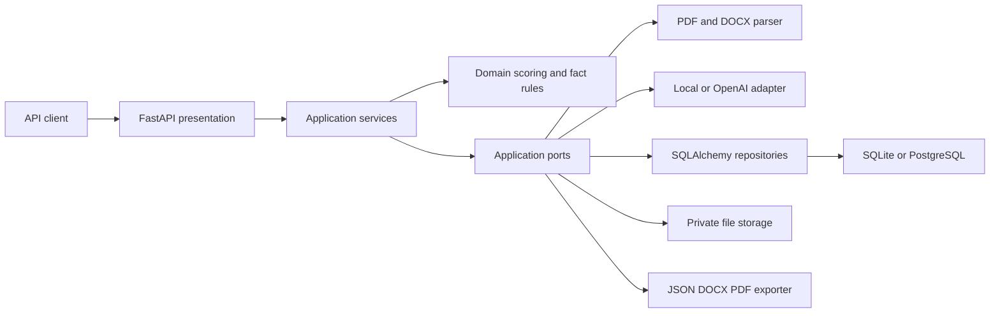

# AI Resume & Job Match Agent

[](https://github.com/Miguesh/AI-Resume-Job-Match-Agent/actions/workflows/ci.yml)
[](https://www.python.org/)
[](LICENSE)

An explainable, fact-guarded API for comparing a PDF or DOCX resume with a target job description, identifying gaps, improving the resume, and exporting the result. The numeric score is produced by versioned business rules—not by an LLM—so the same structured evidence always receives the same score.

This repository is a production-oriented, single-tenant MVP built with Python, FastAPI, Pydantic, SQLAlchemy, PostgreSQL, the OpenAI Responses API, Docker, and pytest. It follows Clean Architecture so matching rules remain independent of web, database, document, and AI-provider concerns.

> [!IMPORTANT]
> Resumes contain highly sensitive personal information. Review [Security and privacy](#security-and-privacy) before exposing this service to the internet. Generated resumes are drafts and require human review.

## What it does

- Accepts PDF and DOCX resumes with extension, MIME, signature, size, page, and archive-safety checks.
- Extracts structured contact details, skills, experience, education, certifications, and keywords.
- Extracts required and preferred skills, responsibilities, education, experience, and keywords from a job description.
- Computes an explainable, deterministic score across five dimensions.
- Distinguishes missing required skills from missing preferred skills and missing terminology.
- Produces evidence-grounded recommendations without encouraging fabricated qualifications.
- Generates an optimized draft through either an offline deterministic adapter or OpenAI.
- Blocks several classes of unsupported AI-generated claims with a post-generation fact guard.
- Exports JSON analysis, DOCX, and PDF.
- Persists analyses in SQLite for local development or PostgreSQL with Docker Compose.
- Provides bearer API-key protection, per-process rate limiting, request IDs, structured logging, health checks, and Problem Details error responses.

## Architecture

The application is a modular monolith. Dependencies point inward: presentation and infrastructure depend on application ports and domain types; the domain does not import FastAPI, SQLAlchemy, OpenAI, or document libraries.



See [Architecture](docs/architecture.md), [Scoring policy](docs/scoring.md), and the [Architecture Decision Records](docs/adr/) for the complete rationale.

## Quick start

### Local development

Prerequisites:

- Python 3.12 or 3.13
- [uv](https://docs.astral.sh/uv/)
- GNU Make is optional

```bash
git clone https://github.com/Miguesh/AI-Resume-Job-Match-Agent.git
cd AI-Resume-Job-Match-Agent
cp .env.example .env
uv sync --all-groups
uv run alembic upgrade head
uv run uvicorn resume_matcher.main:app --reload
```

The default `AI_PROVIDER=local` mode is deterministic and makes no external AI request. It is useful for development and tests, but its heuristic extraction is less capable than an LLM.

Verify the service:

```bash
curl --fail http://localhost:8000/api/v1/health/ready
```

Interactive OpenAPI documentation is available in non-production environments at [http://localhost:8000/docs](http://localhost:8000/docs).

### Docker Compose

Copy the example environment file and replace at least the development credentials:

```bash
cp .env.example .env
# Set APP_API_KEYS and POSTGRES_PASSWORD in .env.
docker compose up --build -d
docker compose ps
curl --fail http://localhost:8000/api/v1/health/ready
```

Compose starts the API and PostgreSQL, applies Alembic migrations, and stores database and uploaded-file data in named volumes. Stop the stack with `docker compose down`. Add `--volumes` only when you intentionally want to destroy local persisted data.

## Configuration

Settings are read from environment variables and an optional `.env` file. Comma-separated values are used for API keys, allowed hosts, and CORS origins.

| Variable | Default | Purpose |
|---|---:|---|
| `APP_ENV` | `development` | `development`, `test`, `staging`, or `production`; API docs are disabled in production. |
| `APP_NAME` | `AI Resume & Job Match Agent` | OpenAPI application name. |
| `APP_VERSION` | `0.1.0` | Reported API version. |
| `APP_DEBUG` | `false` | FastAPI debug mode; rejected when `APP_ENV=production`. |
| `APP_API_KEYS` | empty | Comma-separated bearer keys. At least one is required in production. |
| `APP_ALLOWED_HOSTS` | `localhost,127.0.0.1,testserver` | Trusted `Host` header values; wildcard hosts are rejected in production. |
| `APP_CORS_ORIGINS` | empty | Explicit browser origins. Empty disables CORS middleware. |
| `APP_MAX_UPLOAD_BYTES` | `10485760` | Maximum resume size; allowed range is 1 KiB to 25 MiB. |
| `APP_MAX_JOB_DESCRIPTION_CHARS` | `50000` | Application-level job-description character limit. |
| `APP_DATA_RETENTION_DAYS` | `30` | Reserved retention policy value; automatic cleanup is not implemented yet. |
| `APP_RATE_LIMIT_PER_MINUTE` | `30` | Per-client, per-process limit on expensive POST operations. |
| `AI_PROVIDER` | `local` | `local` for offline heuristics or `openai` for structured LLM extraction and optimization. |
| `OPENAI_API_KEY` | empty | Required when `AI_PROVIDER=openai`; never commit it. |
| `OPENAI_MODEL` | `gpt-5.6-luna` | Model passed to the OpenAI Responses API; choose a model available to your account that supports structured outputs. |
| `OPENAI_TIMEOUT_SECONDS` | `45` | OpenAI request timeout. |
| `OPENAI_MAX_RETRIES` | `3` | OpenAI SDK retry count. |
| `DATABASE_URL` | `sqlite+aiosqlite:///./data/resume_matcher.db` | SQLAlchemy async database URL. Compose supplies PostgreSQL. |
| `DATABASE_ECHO` | `false` | SQL statement logging; keep disabled with sensitive data. |
| `DATABASE_AUTO_CREATE_SCHEMA` | `true` | Creates missing tables on startup; use Alembic migrations for managed deployments. |
| `STORAGE_PATH` | `./data/uploads` | Private directory for original resume bytes. |
| `LOG_LEVEL` | `INFO` | Python log level. |
| `LOG_JSON` | `true` | Emit structured JSON logs when true. |
| `POSTGRES_DB`, `POSTGRES_USER`, `POSTGRES_PASSWORD` | development values | Docker Compose PostgreSQL settings; change the password before deployment. |

Production startup rejects debug mode, an empty API-key list, wildcard allowed hosts, and an OpenAI provider without an API key.

## OpenAI setup

The official async OpenAI SDK is used directly; LangChain and LlamaIndex are deliberately not dependencies because the current workflow does not require their orchestration abstractions.

1. Create and protect an API key by following the [OpenAI developer quickstart](https://developers.openai.com/api/docs/quickstart).
2. Select an available model with structured-output support from the [OpenAI model catalog](https://developers.openai.com/api/docs/models). The configured default is `gpt-5.6-luna`.
3. Configure the service without committing secrets:

```dotenv
AI_PROVIDER=openai
OPENAI_API_KEY=your-secret-key
OPENAI_MODEL=your-supported-model
```

4. Restart the API and check `/api/v1/health/ready`; its `ai_provider` check reports the selected adapter, not a live OpenAI connectivity test.

The adapter uses the SDK's Pydantic parsing support described in OpenAI's [Structured Outputs guide](https://developers.openai.com/api/docs/guides/structured-outputs). When OpenAI mode is enabled, extracted resume text, job text, contact information, and optimization context are sent to OpenAI. Confirm your consent, retention, regional, and data-processing requirements before enabling it. OpenAI is used for structured extraction and rewriting only; it never assigns the numeric score.

## Scoring at a glance

Score policy `1.0.0` uses these fixed weights:

| Dimension | Weight | Calculation summary |
|---|---:|---|
| Skills | 45% | Required coverage receives 80% of this dimension and preferred coverage 20% when both exist. |
| Experience | 25% | `min(resume years / required years, 1)`. |
| Keywords | 15% | Normalized overlap with extracted job keywords. |
| Education | 10% | Ordered attainment relative to the extracted minimum. |
| Responsibilities | 5% | Token overlap between resume achievements and job responsibilities. |

The overall score is the sum of each raw dimension score multiplied by its weight, rounded to one decimal place. Missing criteria do not automatically prove a candidate lacks a qualification; they mean the submitted resume did not provide matching extracted evidence. See [docs/scoring.md](docs/scoring.md) for exact empty-set, normalization, and rounding behavior.

## API

All routes are under `/api/v1`. Health routes are public. Every other route requires `Authorization: Bearer <key>` when `APP_API_KEYS` is configured; production requires at least one key.

| Method | Path | Purpose | Rate limited |
|---|---|---|---|
| `GET` | `/health/live` | Process liveness | No |
| `GET` | `/health/ready` | Database readiness and selected AI provider | No |
| `POST` | `/resumes` | Upload and extract a PDF or DOCX resume | Yes |
| `GET` | `/resumes/{resume_id}` | Retrieve structured resume data | No |
| `DELETE` | `/resumes/{resume_id}` | Delete the resume record and original file | No |
| `POST` | `/jobs` | Extract a job description | Yes |
| `GET` | `/jobs/{job_id}` | Retrieve structured job data | No |
| `POST` | `/matches` | Create and persist a deterministic match | Yes |
| `GET` | `/matches/{match_id}` | Retrieve a match | No |
| `POST` | `/matches/{match_id}/optimize` | Generate and validate an optimized draft | Yes |
| `GET` | `/matches/{match_id}/exports/{format_name}` | Download `json`, `docx`, or `pdf` | No |

Detailed schemas, errors, status codes, and a complete workflow are in [docs/api.md](docs/api.md).

### Example requests

Set reusable values for the examples:

```bash
export BASE_URL=http://localhost:8000/api/v1
export API_KEY=replace-with-your-configured-key
```

Upload a resume:

```bash
curl --fail-with-body \
  -H "Authorization: Bearer $API_KEY" \
  -F "file=@/path/to/resume.pdf;type=application/pdf" \
  "$BASE_URL/resumes"
```

Create a job description:

```bash
curl --fail-with-body \
  -H "Authorization: Bearer $API_KEY" \
  -H "Content-Type: application/json" \
  -d '{
    "job_description": "Senior AI Engineer at Example Corp\n\nRequired: Python, FastAPI, PostgreSQL, Docker, and 5 years of experience.\nPreferred: Kubernetes.\nBuild reliable AI services.\nLead and mentor engineers."
  }' \
  "$BASE_URL/jobs"
```

Create a match after copying the returned IDs:

```bash
curl --fail-with-body \
  -H "Authorization: Bearer $API_KEY" \
  -H "Content-Type: application/json" \
  -d '{"resume_id":"RESUME_UUID","job_id":"JOB_UUID"}' \
  "$BASE_URL/matches"
```

Optimize and export:

```bash
curl --fail-with-body -X POST \
  -H "Authorization: Bearer $API_KEY" \
  "$BASE_URL/matches/MATCH_UUID/optimize"

curl --fail-with-body \
  -H "Authorization: Bearer $API_KEY" \
  -o optimized-resume.docx \
  "$BASE_URL/matches/MATCH_UUID/exports/docx"
```

If `APP_API_KEYS` is intentionally empty in development, omit the authorization header.

## Quality checks

```bash
make lint          # Ruff formatting and lint checks
make typecheck     # strict mypy
make test          # tests excluding external credentials
make coverage      # branch coverage with an 85% project gate
make ci            # consolidated lint, type, and coverage checks
```

Without Make, run the corresponding `uv run ruff`, `uv run mypy`, and `uv run pytest` commands from the [Makefile](Makefile). Integration tests use local dependencies unless marked `external`; OpenAI credentials are not required for the default suite. See [Evaluation](docs/evaluation.md) for quality criteria beyond line coverage.

## Project structure

```text
.
├── src/resume_matcher/
│   ├── domain/             # Entities, deterministic matching, recommendations, fact guard
│   ├── application/        # Use cases and framework-neutral ports
│   ├── infrastructure/     # AI, parsing, persistence, storage, export, logging
│   ├── presentation/api/   # FastAPI routers, schemas, dependencies, middleware, errors
│   ├── config/             # Typed environment settings
│   ├── container.py        # Dependency-injection composition root
│   └── main.py             # ASGI entrypoint
├── tests/                  # Unit, integration, contract, E2E, and opt-in external tests
├── alembic/                # Database migrations
├── docs/                   # Architecture, API, scoring, evaluation, ADRs
├── Dockerfile
├── docker-compose.yml
├── Makefile
└── pyproject.toml
```

## Security and privacy

Existing safeguards include bearer API keys, constant-time key comparison, trusted-host validation, optional explicit CORS, content-size limits, document signature checks, DOCX archive limits, request correlation IDs, no-store and browser security headers, structured-output contracts, prompt-injection instructions, and an optimization fact guard.

Important MVP limitations:

- Authentication is single-tenant. Every valid API key has access to every known resource ID; there is no user identity, per-record authorization, or admin role.
- Original files and structured profiles are not encrypted by the application. Use encrypted host volumes, encrypted backups, least-privilege filesystem/database access, and TLS at the deployment edge.
- `APP_DATA_RETENTION_DAYS` is not yet enforced automatically. Operators must delete records and manage backups according to their policy.
- JSON exports contain the selected resume, target job, and match analysis. The target job always includes its raw text; an export created before optimization also includes raw resume text, while an optimized resume object does not. Treat every export as sensitive data.
- OpenAI mode sends sensitive resume and job data to an external provider. Local mode avoids that transfer.
- Rate limiting is an in-memory, per-process safety net. Docker runs multiple workers, so production needs shared edge rate limiting and request/body limits.
- PDF parsing does not perform OCR, rejects password-protected documents, and relies on third-party parsers that must be patched promptly.
- The fact guard preserves name/contact fields; rejects added skills, certifications, roles, or education; preserves role dates/location and education metadata; and requires every recorded change to cite non-empty source-present evidence. A changed headline or summary must have a corresponding change record, as must any non-reordering change to experience bullets or experience skills. It still cannot prove that an evidence-grounded rewrite preserves the source meaning or that a new metric or implication is true. Human review is mandatory.
- There is no malware scanner, background job isolation, automated retention worker, audit event store, or multi-tenant authorization layer in this release.
- A match score is decision support, not a hiring recommendation, legal determination, or guarantee of ATS behavior.

Read the repository-specific [threat model](AI-Resume-Job-Match-Agent-threat-model.md) and [security policy](SECURITY.md) before a public deployment. Report vulnerabilities through [GitHub Security Advisories](https://github.com/Miguesh/AI-Resume-Job-Match-Agent/security/advisories/new) rather than a public issue.

## Roadmap

- **Current MVP:** secure document ingestion, local/OpenAI extraction, deterministic matching, recommendations, fact-guarded optimization, persistence, exports, Docker, migrations, tests, and CI quality gates.
- **Next:** automated retention and deletion verification, encrypted object-storage adapter, distributed rate limiting, audit events, asynchronous jobs, idempotency, cancellation, and cost budgets.
- **Before multi-user use:** identity-provider integration, tenant ownership on every record, scoped authorization, key rotation, quotas, and privacy workflows.
- **Later:** OCR in an isolated worker, resume-layout templates, a browser UI, multilingual evaluation, semantic skill taxonomy, human-reviewed benchmark datasets, and deployment guides for selected platforms.

## Contributing and license

Issues and focused pull requests are welcome. Read [CONTRIBUTING.md](CONTRIBUTING.md), run `make ci` before submitting a change, and include tests for behavioral changes. Security-sensitive findings should follow [SECURITY.md](SECURITY.md).

Licensed under the [MIT License](LICENSE).
