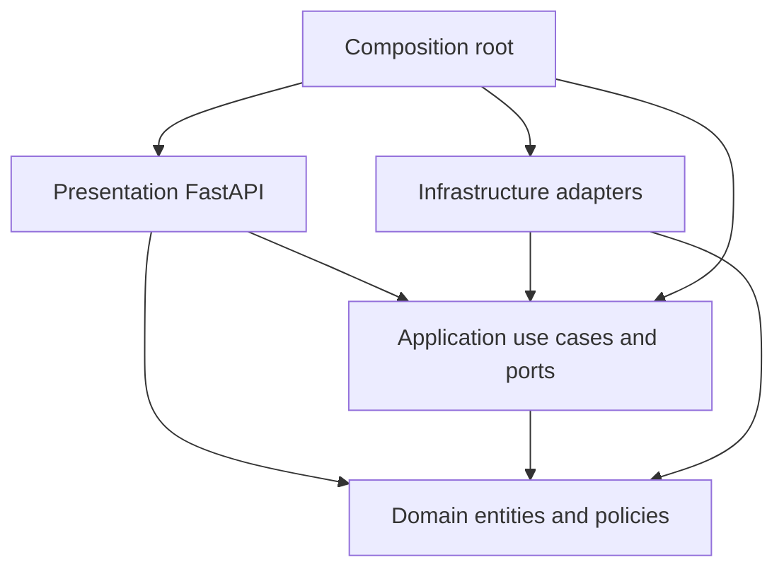

# Architecture

## Architecture in one sentence

The service is a Clean Architecture modular monolith: FastAPI and infrastructure adapters are replaceable details around application use cases and a framework-independent domain that owns scoring and factual-integrity rules.

## Goals and constraints

The architecture optimizes for:

- reproducible and explainable matching;
- strict separation between business policy and external services;
- offline development and deterministic tests;
- safe handling of untrusted documents and highly sensitive resume data;
- replaceable AI, persistence, storage, parsing, and export implementations;
- an operationally simple MVP that can later move slow work to durable workers.

This release is intentionally a modular monolith, not a collection of microservices. Parsing, AI calls, scoring, persistence, and export run in one API process. See [ADR 0001](adr/0001-modular-monolith-clean-architecture.md) and [ADR 0005](adr/0005-synchronous-mvp.md).

## Dependency rule



The important rule is what is absent: `domain` does not depend on FastAPI, Pydantic API schemas, SQLAlchemy, OpenAI, PyMuPDF, python-docx, or ReportLab. `application` defines protocols that infrastructure implements.

## Layer responsibilities

| Layer | Main paths | Responsibility |
|---|---|---|
| Domain | `src/resume_matcher/domain/` | Entities, skill normalization, deterministic score policy, recommendations, factual-integrity validation, domain exceptions. |
| Application | `src/resume_matcher/application/` | Use-case orchestration and ports for parsing, storage, AI, repositories, transactions, and export. |
| Infrastructure | `src/resume_matcher/infrastructure/` | PDF/DOCX parsing, local/OpenAI intelligence, SQLAlchemy repositories, database sessions, filesystem storage, exports, logging, rate limiting. |
| Presentation | `src/resume_matcher/presentation/api/` | HTTP routes, Pydantic request/response models, authentication, dependency providers, middleware, error mapping. |
| Configuration/composition | `src/resume_matcher/config/`, `container.py`, `app.py` | Typed environment configuration, adapter selection, object construction, and FastAPI lifecycle. |

### Domain

Domain entities are frozen dataclasses. A `ResumeProfile` and `JobProfile` are the validated evidence given to `MatchingService`. The service returns a versioned `MatchResult` containing dimension scores, matched and missing evidence, recommendations, and a human-readable explanation.

The numeric score is pure business logic. LLM output may become structured input to that logic, but no LLM response can supply or override a dimension or overall score. `ResumeFactGuard` validates an optimized draft before it is persisted.

### Application

Application services implement the use cases:

- `ResumeService`: deduplicate, parse, extract, store, retrieve, and delete resumes;
- `JobService`: extract, persist, and retrieve job descriptions;
- `MatchService`: load evidence, score it, persist the analysis, optimize it, and run the fact guard;
- `ExportService`: load a complete analysis and delegate JSON, DOCX, or PDF rendering.

Ports in `application/ports.py` use Python protocols. Services receive their collaborators through constructors and do not construct infrastructure dependencies.

### Infrastructure

The initial adapters are:

| Port/capability | Adapter |
|---|---|
| Document parsing | `SecureDocumentParser` using PyMuPDF and python-docx |
| Resume intelligence | `LocalResumeIntelligence` or `OpenAIResumeIntelligence` |
| Persistence | Async SQLAlchemy repositories and transaction manager |
| Original document storage | `FileSystemDocumentStorage` keyed by server-generated UUID |
| Export | `MultiFormatResumeExporter` using JSON, python-docx, and ReportLab |
| Rate limiting | `InMemoryRateLimiter` keyed by client address |

The OpenAI adapter uses typed Pydantic contracts and maps provider output into domain types. Provider types do not cross the adapter boundary. The local adapter is network-free and deterministic, enabling development without a key.

### Presentation

FastAPI routers are thin. They validate transport data, resolve application services through dependencies, and map domain entities to response models. Domain exceptions become `application/problem+json` responses. Cross-cutting middleware adds request IDs, logs request metadata, sets defensive headers, validates declared `Content-Length`, and buffers/counts actual ASGI body chunks so chunked requests cannot bypass the application ceiling.

Health endpoints are public. Resume, job, and match routers use a bearer API-key dependency. Expensive POST routes also use the in-process rate limiter.

### Composition root

`AppContainer.build()` is the single composition root. It chooses the AI adapter from `AI_PROVIDER` and constructs long-lived infrastructure objects. Each request receives an async database session and fresh application services wired to repositories using that session.

This explicit composition keeps dependency injection understandable without requiring a DI framework.

## Runtime data flows

### Resume ingestion

1. The client submits a multipart PDF or DOCX to `POST /api/v1/resumes`.
2. Presentation dependencies authenticate the bearer key and check the per-process request rate.
3. The router streams the upload in 1 MiB chunks and stops at `APP_MAX_UPLOAD_BYTES`.
4. `ResumeService` hashes the bytes and returns an existing resource for an identical SHA-256 digest.
5. `SecureDocumentParser` validates the extension, declared MIME type, file signature, and parser-specific safety limits before extracting text.
6. The configured intelligence adapter converts text to a validated `ResumeProfile`.
7. The original bytes are stored under a generated UUID; the structured profile and raw text are stored through the repository.
8. Storage is compensated if the database transaction fails.

### Job extraction and matching

1. The client posts job text to `POST /api/v1/jobs`.
2. The intelligence adapter extracts a `JobProfile`, which is persisted.
3. The client posts the resume and job UUIDs to `POST /api/v1/matches`.
4. `MatchService` retrieves both profiles and calls the pure `MatchingService`.
5. The five dimension scores, evidence, recommendations, score version, and explanation are persisted as one analysis.

### Optimization and export

1. `POST /api/v1/matches/{id}/optimize` loads the match, resume, and job.
2. The intelligence adapter creates an optimized structured draft.
3. `ResumeFactGuard` preserves identity/contact data and verified role/education metadata; rejects added skills, certifications, roles, or education; and requires every recorded change to cite non-empty evidence present in the source text. Headline/summary rewrites and non-reordering experience bullet/skill changes must also have corresponding evidence records.
4. A passing draft is persisted with the analysis.
5. Export selects the optimized draft when present and otherwise uses the original profile.
6. JSON includes the selected resume, target job, and match evidence. The job profile includes raw job text; the original `ResumeProfile` includes raw resume text when no optimized draft has replaced it. DOCX and PDF render the selected resume without a separate analysis section.

## Data model and persistence

| Aggregate | Table | Sensitive contents | Lifecycle |
|---|---|---|---|
| `ResumeDocument` | `resumes` | Contact data, employment history, education, raw extracted text, file hash | Created by upload; deletable through the API. |
| `JobDescription` | `job_descriptions` | Original job text and extracted hiring criteria | Created by API; no delete endpoint in this release. |
| `MatchAnalysis` | `match_analyses` | Score evidence, recommendations, optional optimized resume | References resume and job; database foreign keys enforce cascade deletion, including explicit SQLite foreign-key enablement. |

Original uploaded bytes are stored outside the database at `STORAGE_PATH/{resume_uuid}.bin`. The adapter forces the upload directory to `0700`, files to `0600`, writes through an atomic temporary replacement, and removes a failed temporary write. Local development defaults to SQLite; Docker Compose supplies PostgreSQL. Alembic owns the deployable schema history.

Database and file writes cannot participate in one atomic transaction. Upload compensates for a database failure by deleting the newly stored file. Resume deletion removes the database row, then the file, then commits; production operations should monitor for orphaned records/files and verify backup deletion separately.

## Scoring boundary

The scoring boundary is deliberately narrow:

```text
validated ResumeProfile + validated JobProfile
                    |
                    v
       MatchingService policy 1.0.0
                    |
                    v
 versioned MatchResult with evidence and recommendations
```

Structured extraction quality affects the evidence presented to the scorer, but the score calculation itself is deterministic. Details and formulas are in [scoring.md](scoring.md); the design rationale is in [ADR 0002](adr/0002-deterministic-scoring.md).

## AI boundary

AI is behind the `ResumeIntelligence` port. The OpenAI adapter:

- sends untrusted document content as JSON data separate from developer instructions;
- uses the Responses API structured parsing feature with strict Pydantic contracts;
- maps timeouts, connection failures, rate limits, and provider errors to application exceptions;
- never returns an overall or dimension score;
- subjects optimized output to a deterministic fact guard that preserves identity/contact fields, role dates/location, and education metadata; prevents added skills/certifications; validates source-present change evidence; and rejects headline/summary rewrites or non-reordering experience bullet/skill changes that lack a change record.

The direct SDK decision is documented in [ADR 0003](adr/0003-direct-openai-sdk.md). Prompt and optimization versions live in `infrastructure/ai/prompts.py` and should be evaluated whenever changed.

## Deployment views

### Local

- One Uvicorn development process
- SQLite database under `./data`
- Original files under `./data/uploads`
- Local AI adapter by default
- Automatic schema creation enabled by default

### Docker Compose

- API container running as a non-root system user
- Two Uvicorn worker processes
- PostgreSQL 17 container
- Named volumes for PostgreSQL and original resume files
- Alembic migration on API startup
- Container liveness health check

TLS termination, shared rate limiting, firewalling, volume encryption, encrypted backups, and secret injection belong to the deployment environment and are not supplied by Compose. The repository-specific [threat model](../AI-Resume-Job-Match-Agent-threat-model.md) treats those as explicit deployment assumptions.

## Operational characteristics

- **Synchronous request model:** parsing and OpenAI calls complete before HTTP responses return. This is simple but consumes worker capacity during provider latency.
- **Idempotency:** exact resume bytes are deduplicated globally by SHA-256. Job, match, and optimization POSTs do not accept idempotency keys.
- **Concurrency:** database work is async; document parsing and export are local CPU/memory work. There is no worker queue or cancellation API.
- **Rate limiting:** the built-in limiter is per process and not a distributed production control.
- **Logging:** JSON logs include request ID, method, path, status, and duration. A filter redacts common bearer tokens, OpenAI-style keys, and email addresses from formatted messages. Request bodies are not intentionally logged.
- **API versioning:** routes use `/api/v1`; score behavior has its own `score_version`.

## Security design and known limits

Implemented controls include production configuration validation, constant-time API-key comparisons, trusted hosts, optional allowlisted CORS, no-store responses, upload safety checks, typed AI output, conservative prompts, and a post-generation fact guard.

The architecture does not yet provide tenant ownership, field-level encryption, automatic retention, distributed quotas, malware scanning, isolated document workers, durable audit events, or comprehensive semantic verification of rewritten prose. These are release constraints, not implied infrastructure features. See the [threat model](../AI-Resume-Job-Match-Agent-threat-model.md) and [evaluation plan](evaluation.md).

## Decisions

- [ADR 0001: Modular monolith with Clean Architecture](adr/0001-modular-monolith-clean-architecture.md)
- [ADR 0002: Deterministic versioned matching](adr/0002-deterministic-scoring.md)
- [ADR 0003: Direct OpenAI SDK integration](adr/0003-direct-openai-sdk.md)
- [ADR 0004: PostgreSQL and filesystem storage behind ports](adr/0004-persistence-and-storage.md)
- [ADR 0005: Synchronous MVP workflow](adr/0005-synchronous-mvp.md)
